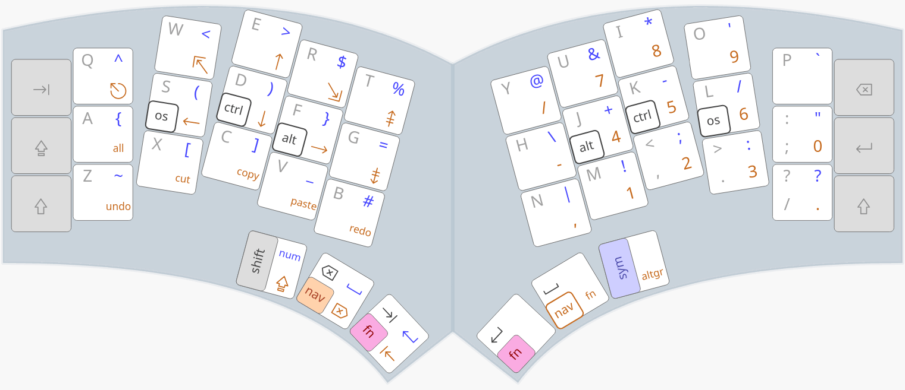

# Quacken ZMK Module

A Zephyr module to build your own ZMK firmware for the Quacken:

- common options can be safely defined in `keymaps/settings.h`
- keymap layers can be customized in `keymaps/quacken.keymap`


## Releases

The default configuration implements the [Selenium] keymap:



Pre-built binaries are proposed in the [releases].
Each zip archive is specific to a host keyboard layout,
and contains 8 `.uf2` files to accommodate:
- the 4 hold-tap flavors: [EZ], [TT], [HRM], [2TK]
- the 2 variants: standard or [Vim variant]

Download the archive for your host layout, [flash it](#flash), you’re done.

[releases]:    https://github.com/Nuclear-Squid/zmk-keyboard-quacken/releases
[Selenium]:    https://github.com/OneDeadKey/selenium
[Vim variant]: https://onedeadkey.github.io/selenium/#vim-variant
[EZ]:          https://onedeadkey.github.io/selenium/#flavor-ez
[TT]:          https://onedeadkey.github.io/selenium/#flavor-tt
[HRM]:         https://onedeadkey.github.io/selenium/#flavor-hrm
[2TK]:         https://onedeadkey.github.io/selenium/#flavor-2tk


## Configuration

### `keymaps/settings.h`

This is where [Selenium] options can be safely selected.
This file should be self-explanatory, but here are the main options:

- `HT_*` selects the hold-tap flavor: [EZ], [TT], [HRM] (default), [2TK].

- `KB_LAYOUT_*` must match the layout used on the host computer.<br>
  If unset, QWERTY is assumed, which **will** result in unexpected symbols or shortcuts
  if a different keyboard layout is used.

- `KB_EMULATION_*` (experimental) activates a layout emulation (none by default).

- `VIM_NAVIGATION` enables the [Vim variant](https://onedeadkey.github.io/selenium/#vim-variant).

### `keymaps/selenium.keymap`

This is where all Selenium layers are defined and can be customized.

See the [customizing ZMK](https://zmk.dev/docs/customization) documentation.


## Build With GitHub Actions (GHA)

This is the recommended method for most users.

### In a Nutshell

- [create a GitHub account](https://github.com/signup) if you don’t already have one
- fork this repository
- modify `keymaps/settings.h` to set your options
- tweak `keymaps/quacken.keymap` if needed (see the [customizing ZMK](https://zmk.dev/docs/customization) documentation)
- save, commit, push

Your firmware will now be built automatically by GitHub’s CI:

- check the `Actions` tab
- wait for the latest action task to complete
- click on this task
- download the `zmk_quacken_{flex,zero}.uf2` artifact matching your keyboard model
- [flash](#flash)

### Using github.com

TODO

### Using GitHub-Desktop

TODO

### Using `zmk-cli`

See <https://zmk.dev/docs/user-setup>.


## Build Locally

Advanced users and developers may prefer to build their firmware locally,
especially for debugging purposes.

### Setup

We need [a local ZMK clone with its Zephyr toolchain][toolchain].
This requires about 15GB of disk space: 10GB for the Zephyr SDK,
5GB for ZMK/Zephyr and their dependencies.

First [install all host Zephyr dependencies][dependencies]
— for Ubuntu it’d be:

```bash
sudo apt install --no-install-recommends \
  git cmake ninja-build gperf ccache dfu-util device-tree-compiler wget \
  python3-dev python3-pip python3-setuptools python3-tk python3-wheel \
  xz-utils file make gcc gcc-multilib g++-multilib libsdl2-dev libmagic1
```

[toolchain]: https://zmk.dev/docs/development/local-toolchain/setup/native
[dependencies]: https://docs.zephyrproject.org/latest/develop/getting_started/index.html#install-dependencies

Make sure [uv](https://docs.astral.sh/uv/) is installed,
then proceed with ZMK:

```bash
# clone ZMK
git clone https://github.com/zmkfirmware/zmk.git
cd zmk

# activate a venv, install west + ZMK dependencies
uv init
uv add west
source .venv/bin/activate
west init -l app
west update  # this installs Zephyr and other ZMK stuff (takes a while)

# install Zephyr's dependencies and SDK
cd zephyr
uv pip install -r scripts/requirements-base.txt
uv pip install protobuf grpcio-tools
west sdk install  # (this takes a while)
```

When done, symlink the ZMK folder in the local `zmk-keyboard-quacken` folder,
so that the build script can use this ZMK/Zephyr setup:

```bash
cd /path/to/zmk-keyboard-quacken
ln -s /path/to/zmk .
```

### Build

Once the ZMK/Zephyr toolchain is set, the Quacken firmware is built as follows:

```bash
./build {flex,zero} [optional_C++_flags]
```

- `flex` or `zero` relates to the Quacken variant in use
- `optional_C++_flags` enables keymap options defined in `keymap/quacken.keymap`

Examples:

```bash
# build the default Quacken Zero firmware
./build zero

# build the default Quacken Flex firmware
./build flex

# build a Quacken Flex firmware with thumb-taps instead of homerow-mods
./build flex -DHT_THUMB_TAPS
```

The firmware (`zmk_quacken_{flex,zero}.uf2`) can be found in the current directory and is ready to be [flashed](#flash).

### Debug

To enable USB logging, uncomment the `USB_LOGGING` line in the `build` script:
after flashing, you can track the USB logs for every keypress on a serial monitor (e.g. `/dev/ttyACM0` on Linux).

You may also comment out the `PRISTINE` line in the `build` script to enable incremental builds.

Note: local builds use the `zmk` tree, no matter what’s specified in the
`config/west.yml` file (which is used by GitHub Actions). Remember to run a
`west update` when modifying the `zmk` tree (e.g. checking out another branch/commit).


## Flash

To flash  your keyboard with a `.uf2` file:
1. hold the bootloader button while plugging the keyboard;
2. your keyboard now appears as a removable storage device: `RPI-UF2`;
3. drag the `.uf2` file onto the `RPI-UF2` drive;
4. the keyboard restarts, the `RPI-UF2` drive is unmounted, done.

More info: <https://zmk.dev/docs/user-setup#flash-uf2-files>.
